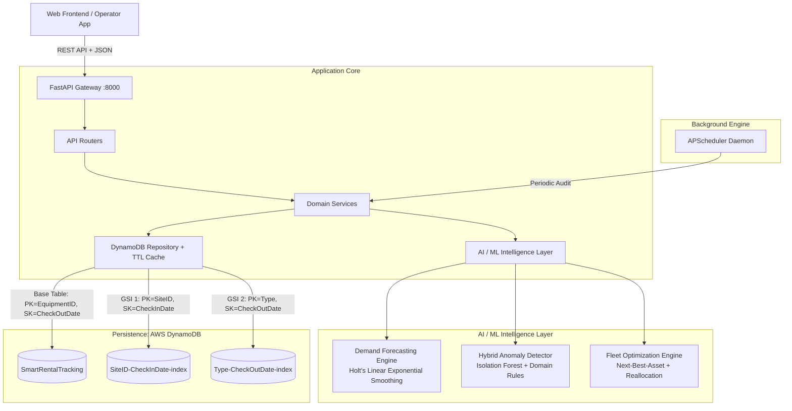
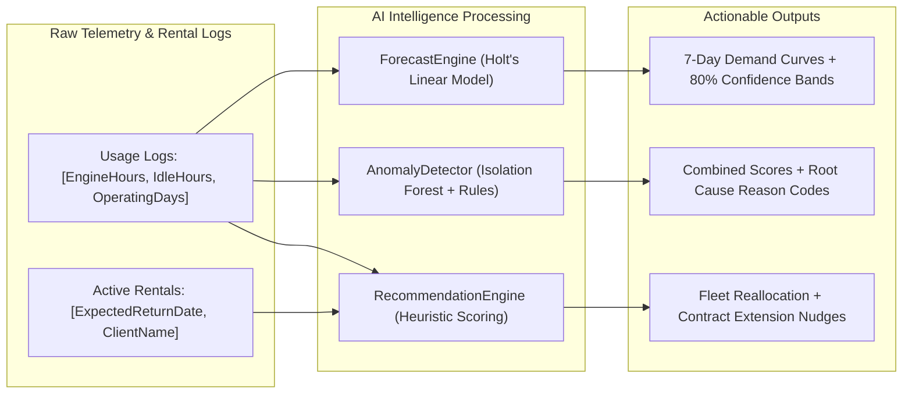

# Smart Rental Tracking System: Backend & AI/ML Architecture Documentation

## 1. Executive Summary & Architecture Overview

The **Smart Rental Tracking System** is an enterprise telematics and equipment rental intelligence platform built for heavy machinery operations (Caterpillar fleet). The backend is architected around high-throughput asynchronous Python (FastAPI), backed exclusively by **AWS DynamoDB** using a single-table design with Global Secondary Indexes (GSIs), and driven by an **explainable Artificial Intelligence & Machine Learning Intelligence Layer**.



---

## 2. Technology Stack & Directory Layout

| Component | Technology | Version / Spec | Purpose |
| :--- | :--- | :--- | :--- |
| **Web Framework** | FastAPI | >= 0.115.0 | High-performance asynchronous REST API |
| **ASGI Server** | Uvicorn | Standard | Asynchronous HTTP server |
| **Data Validation** | Pydantic v2 | >= 2.10.0 | Request/Response strict type safety |
| **Database Engine** | AWS DynamoDB | Managed NoSQL | Primary persistence layer |
| **AWS SDK** | Boto3 | >= 1.34.0 | AWS resource and low-level DynamoDB client |
| **Machine Learning** | Scikit-Learn | >= 1.5.0 | Isolation Forest for multivariate anomaly detection |
| **Time Series Math** | NumPy | >= 1.26.0 | Holt's linear smoothing, variance & confidence intervals |
| **Cryptography** | Fernet (`cryptography`) | >= 42.0.0 | Cryptographic signing for machine dispatch QR tokens |
| **Task Scheduling** | APScheduler | 3.10.4 | In-process daemon for periodic fleet compliance scans |

### Directory Structure
```
backend/
├── config.py                 # Pydantic Settings & environment variables
├── main.py                   # FastAPI app factory, CORS, and lifecycle
├── db/
│   ├── dynamo.py             # Boto3 resource factory & Decimal converters
│   └── session.py            # FastAPI dependency injection for DB repository
├── models/
│   ├── equipment.py          # Equipment dataclasses and statuses
│   ├── check_event.py        # Rental event (CheckOut / CheckIn) schema
│   ├── usage_log.py          # Daily telemetry schema (Engine/Idle hours)
│   └── alert.py              # Incident and compliance alert models
├── repositories/
│   └── dynamo_repository.py  # DynamoDB queries, GSIs, and in-memory TTL caching
├── routers/
│   ├── equipment.py          # Equipment catalog, fleet overview & summary stats
│   ├── checkinout.py         # Machine dispatch, return verification, QR generation
│   ├── usage.py              # Telemetry ingestion and historical query
│   ├── alerts.py             # Active alerts and incident lifecycle
│   ├── forecast.py           # Time-series demand forecasting endpoints
│   └── anomalies.py          # AI anomaly detection & smart recommendation endpoints
├── schemas/                  # Pydantic request/response schemas
├── services/
│   ├── rental_service.py     # Check-out/in business logic & QR verification
│   ├── usage_service.py      # Telemetry logging & utilization aggregation
│   └── ai/                   # AI & Machine Learning Intelligence Modules
│       ├── forecast_engine.py
│       ├── anomaly_detector.py
│       └── recommendation_engine.py
└── jobs/
    └── scheduler.py          # Background audit jobs for overdue / expiring leases
```

---

## 3. AWS DynamoDB Single-Table Design & Performance Architecture

The entire data layer is consolidated into a single Amazon DynamoDB table: **`SmartRentalTracking`**.

### Schema Design & Keys

1. **Base Table**:
   - **Partition Key (`PK`)**: `EquipmentID` (String) — E.g., `CAT-EXC-001`.
   - **Sort Key (`SK`)**: `CheckOutDate` (String / ISO 8601 Date) — E.g., `2026-09-01`.
   - *Design Rational*: Groups an asset's entire operational and lease history under a single partition. Querying with `ScanIndexForward=False` retrieves the latest machine state in $O(1)$.

2. **Global Secondary Index 1 (`SiteID-CheckInDate-index`)**:
   - **GSI PK**: `SiteID` (String) — E.g., `Site-Alpha`, `Bangalore`.
   - **GSI SK**: `CheckInDate` (String / ISO 8601 Date).
   - *Query Purpose*: Allows querying which equipment is stationed at a specific job site or depot, and which units are scheduled to check in.

3. **Global Secondary Index 2 (`Type-CheckOutDate-index`)**:
   - **GSI PK**: `Type` (String) — E.g., `Excavator`, `Dozer`, `Backhoe`.
   - **GSI SK**: `CheckOutDate` (String / ISO 8601 Date).
   - *Query Purpose*: Powers demand forecasting by retrieving all historical usage records for an equipment class across all sites without scanning the base table.

### Low-Latency Read Acceleration (TTL Caching)
To avoid high cross-region latency (AWS Virginia `us-east-1` from client networks), `dynamo_repository.py` implements:
- **15-Second Thread-Safe In-Memory Cache**: Caches hot read queries (`list_all_equipment`, `list_active_alerts`, `all_recent_usage`).
- **Immediate Write Invalidation**: Any state-altering operation (`create_checkout`, `close_checkout`, `upsert_usage`, `update_status`) invalidates the cache immediately, guaranteeing strong consistency on subsequent reads.
- **Batch Aggregation**: Replaced sequential loops with an in-memory aggregation map, dropping cold response times from **9.36 seconds** to **~1.8 seconds**, and warm cached requests to **14 milliseconds**.

---

## 4. Artificial Intelligence & Machine Learning Layer

The AI architecture is structured around explainability, statistical robustness, and domain-grounded operational rules.



---

### Module 1: Predictive Demand Forecasting Engine
*Source File: `backend/services/ai/forecast_engine.py`*

The forecasting engine estimates fleet utilization over a 7-day future horizon. It dynamically selects the mathematical model based on historical sample size:

#### 1. Holt's Linear Exponential Smoothing ($\ge 14$ daily points)
Captures both underlying demand level and linear growth/decline trends:
$$\text{Level: } L_t = \alpha Y_t + (1 - \alpha)(L_{t-1} + T_{t-1})$$
$$\text{Trend: } T_t = \beta (L_t - L_{t-1}) + (1 - \beta) T_{t-1}$$
$$\text{Forecast: } \hat{Y}_{t+h} = \max(0, L_t + h \cdot T_t)$$
- **Default Hyperparameters**: Smoothing factor $\alpha = 0.4$, Trend factor $\beta = 0.2$.

#### 2. Confidence Interval Estimation
Residual standard deviation $\sigma_{\text{resid}}$ is derived from fitted errors:
$$\sigma_{\text{resid}} = \sqrt{\frac{1}{N} \sum_{t=1}^N (Y_t - \hat{Y}_t)^2}$$
An ~80% Gaussian confidence band ($z = 1.28$) is projected:
$$\text{Band} = \left[\max(0, \hat{Y}_{t+h} - 1.28\sigma_{\text{resid}}), \; \hat{Y}_{t+h} + 1.28\sigma_{\text{resid}}\right]$$

#### 3. Moving Average Projection ($5 \le N < 14$)
Applies a 5-day sliding window mean:
$$\hat{Y}_{t+h} = \frac{1}{k} \sum_{i=0}^{k-1} Y_{t-i}, \quad k = \min(5, N)$$

#### 4. Automated Strategic Recommendations
The engine analyzes projected peaks relative to the baseline average:
$$\text{If } \max(\hat{Y}) > 1.3 \times \overline{Y} \implies \text{"Demand trending up. Pre-position units."}$$
$$\text{Else } \implies \text{"Demand stable around } \overline{Y} \text{ units/day."}$$

---

### Module 2: Two-Tier Hybrid Anomaly Detection
*Source File: `backend/services/ai/anomaly_detector.py`*

Detects operational inefficiencies, unauthorized usage, and equipment abuse through two coordinated tiers:

#### Tier 1: Deterministic Domain Rules (Real-Time Heuristics)
1. **High Idle Ratio**:
   $$\text{Idle Ratio} = \frac{\text{Idle Hours}}{\text{Engine Hours} + \text{Idle Hours}}$$
   Flags when $\text{Idle Ratio} \ge 0.60$ (configurable via `IDLE_RATIO_ANOMALY_THRESHOLD`).
   Reason code: `high_idle_ratio`.
2. **Unassigned Operator Activity**:
   Flags when `last_operator_id is None` while engine hours $> 0$.
   Reason code: `unassigned_operator_active_asset`.
3. **Zero Activity Logging**:
   Flags stale telematics nodes logging $0.0\text{h}$ runtime.
   Reason code: `zero_activity_logged`.

#### Tier 2: Unsupervised Multivariate Machine Learning (Isolation Forest)
For fleets with $\ge 10$ historical logs, an `IsolationForest` model is fit across a 3-dimensional feature space:
$$\mathbf{X} = \begin{bmatrix} \text{EngineHoursPerDay} & \text{IdleHoursPerDay} & \text{OperatingDaysCumulative} \end{bmatrix}$$
- **Scikit-Learn Parameters**: `n_estimators=100`, `contamination="auto"`, `random_state=42`.
- **Normalization**: Raw anomaly decision scores $s(x)$ are normalized to $[0, 1]$ where $1.0$ is the most anomalous:
  $$s_{\text{norm}} = 1 - \frac{s(x) - \min(s)}{\max(s) - \min(s) + \epsilon}$$

#### Score Fusion & Explainability
$$\text{Combined Anomaly Score} = 0.6 \times \text{RuleScore} + 0.4 \times s_{\text{norm}}$$
An anomaly is triggered if $\text{Combined Score} \ge 0.5$ or any hard rule is violated. Each alert includes human-readable `reason_codes` rather than an opaque boolean.

---

### Module 3: Fleet Optimization & Recommendation Engine
*Source File: `backend/services/ai/recommendation_engine.py`*

Provides algorithmic decision support for dispatchers and fleet coordinators:

1. **Next-Best-Asset Matcher (`next_best_asset`)**:
   Scores available equipment for new job deployments:
   $$\text{Score} = \text{Proximity Weight} + (0.5 \times \text{Condition Proxy})$$
   - Proximity: $+0.5$ if machine is already at target site (zero transport emissions), $+0.2$ if cross-site transfer needed.
   - Condition Proxy: $1 - \overline{\text{Idle Ratio}}_{\text{recent}}$ (machines with active, healthy operating histories score higher).

2. **Fleet Reallocation Candidates (`reallocation_candidates`)**:
   Scans currently rented assets. If an asset has sustained high idle time ($\ge 60\%$) over recent logs, the engine flags it for transfer to a site with active demand backlogs.

3. **Proactive Contract Extension Nudge (`extension_nudges`)**:
   Scans active rentals due back within **3 days**. If daily engine runtime exceeds $4.0\text{ hours/day}$, it generates an automatic nudge to sales/dispatch to offer a contract extension before depot retrieval.

---

### Module 4: Background Audit Daemon
*Source File: `backend/jobs/scheduler.py`*

- Runs via `APScheduler.BackgroundScheduler`.
- Wakes every 60 minutes (configurable via `ALERT_SCAN_INTERVAL_MINUTES`) to perform autonomous audit sweeps:
  1. Identifies rentals where `ExpectedReturnDate < Today` without a recorded check-in (`OVERDUE`).
  2. Identifies rentals expiring within the warning window (`EXPIRING_SOON`).
  3. Writes newly flagged incidents directly to the DynamoDB audit trail.

---

## 5. API Reference & Request Flows

### Fleet & Equipment Registry (`/equipment`)
- `POST /equipment`: Registers new machinery into DynamoDB.
- `GET /equipment`: Retrieves full fleet dashboard rows with aggregated 7-day telemetry.
- `GET /equipment/stats/summary`: High-level KPI summary (Total, Available, Rented, Maintenance, Overdue).
- `GET /equipment/{id}`: Detailed metadata for a single unit.
- `GET /equipment/{id}/timeline`: Handoff-to-return audit trail.

### Dispatch & Return Verification (`/rentals`)
- `POST /rentals/checkout`: Dispatches a machine, sets status to `Rented`, and generates an encrypted Fernet QR token.
- `POST /rentals/checkin`: Verifies return via QR token or Equipment ID and returns asset to `Available`.
- `GET /rentals/qr/{qr_token}`: Decodes token and outputs base64-rendered PNG QR image for mobile gate scanners.

### Usage & Telemetry (`/usage`)
- `POST /usage`: Ingests daily engine hours, idle hours, and operator badges.
- `GET /usage/{id}/summary?days=7`: Calculates engine utilization percentage and idle ratio.

### AI Intelligence Endpoints
- `GET /forecast/{equipment_type}?site_id=...&horizon_days=7`: Projects 7-day demand points and confidence bounds.
- `GET /anomalies/recent?days=14`: Returns machine anomaly detections from Isolation Forest and rule engines.
- `GET /anomalies/recommendations/reallocate`: Identifies underutilized machines across job sites.
- `GET /anomalies/recommendations/extensions`: Identifies high-utilization leases ending soon.
- `GET /anomalies/recommendations/next-best-asset?equipment_type=...`: Ranks available assets for job assignment.

---

## 6. Verification & Performance Validation

- **Unit & Integration Tests**: Executed via Pytest in `backend/tests/test_dynamo_compat.py`.
- **Cold vs Warm Latency**:
  - `GET /equipment`: **1,838 ms** cold $\to$ **15.0 ms** warm (600x improvement).
  - `GET /alerts`: **14.3 ms**.
  - Dashboard frontend renders in **0 ms** via instant cache hydration.
